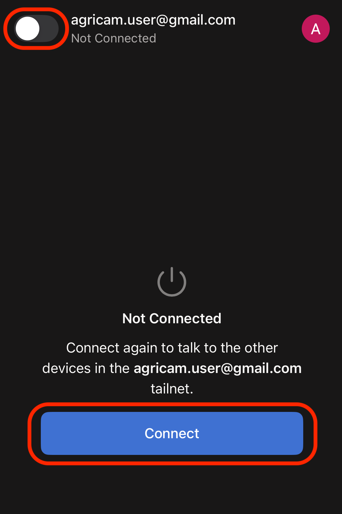
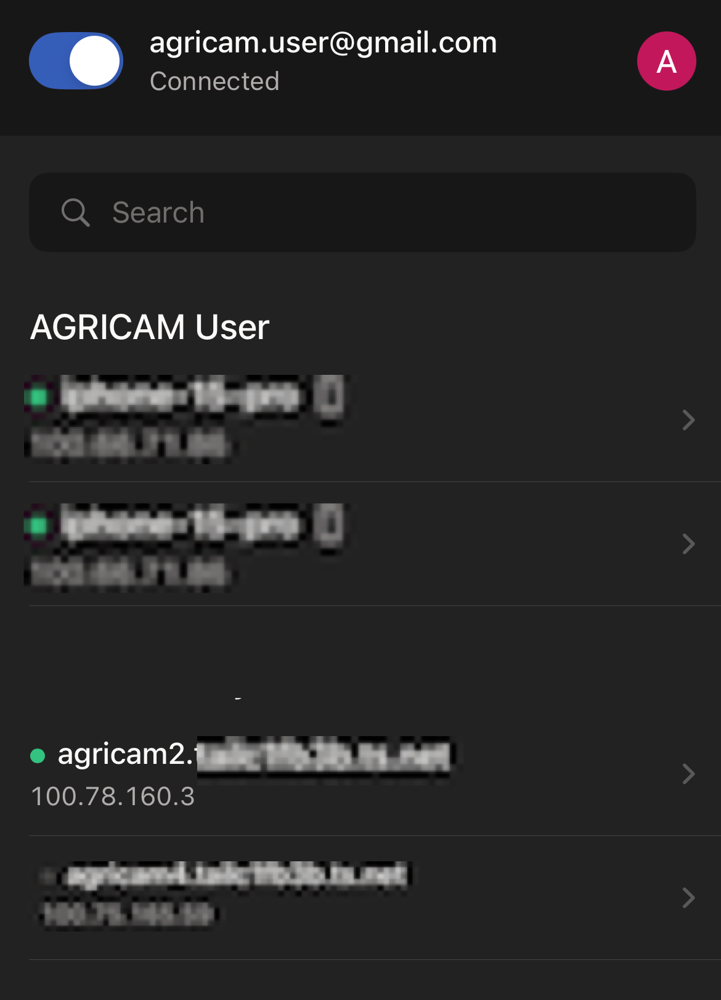
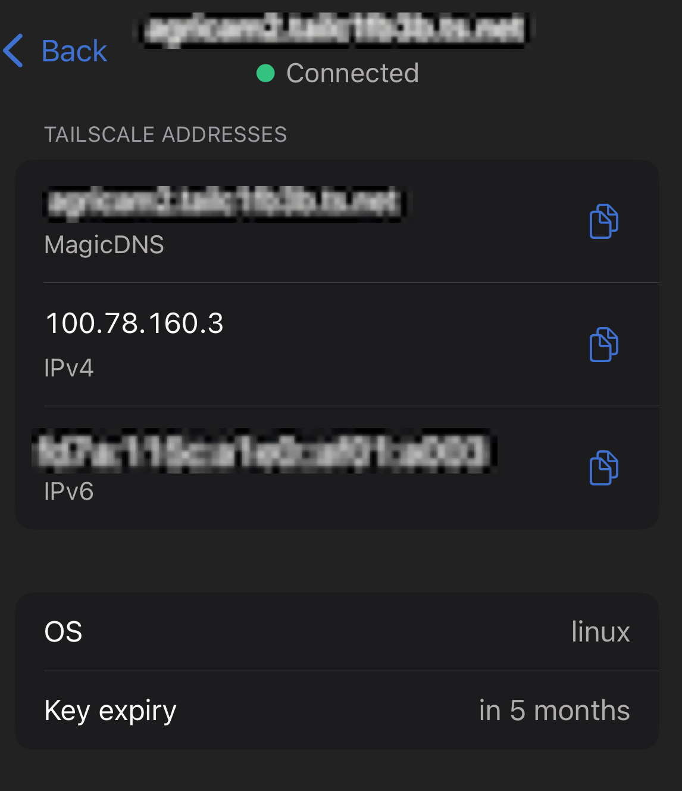

# Connection Setup

!!! success "Already Connected to AGRICAM Tailnet?"
    If you have already set up and connected to the AGRICAM Tailnet, use the following links to access the robot dashboards. Remember, Tailscale must be active on your device.

    * **AGRICAM 2:** [http://agricam2:5000](http://100.78.160.3:5000)
    * **AGRICAM 4:** [http://agricam4:5000](http://100.78.160.3:5000)


To ensure a secure and reliable connection to the AGRICAM robots from any location, we use **Tailscale**. Tailscale creates a private network (a "tailnet") that directly connects your devices to our robots, allowing you to access their control dashboards as if you were on the same local network.

This guide provides step-by-step instructions for setting up Tailscale and connecting to the AGRICAM network.

## Set Up Tailscale

First, install the Tailscale application on the device you will use to control the robots (e.g., your smartphone, tablet, or computer).

1. **Download the application** for your specific device:

      -  **iOS (iPhone/iPad):** [**Tailscale on the App Store**](https://apps.apple.com/us/app/tailscale/id1470499037)

      * **Android:** [**Tailscale on Google Play**](https://play.google.com/store/apps/details?id=com.tailscale.ipn)

      * **Desktop (Windows, macOS, Linux):** [**Tailscale Downloads Page**](https://tailscale.com/download)

!!! note "Tailscale VPN"
    You will be prompted to allow the Tailscale app to install VPN (Virtual Private Network) settings on your device. Approve this request to enable Tailscale to create a secure private network connection.

1. **Launch the application** after installation.

2. **Log In to Create an Account.** You will be prompted to log in using an existing identity provider. Select your preferred service (**Google, Microsoft, Apple, or GitHub**) and follow the on-screen instructions to authorize Tailscale. This will create your Tailscale account.


## Request Access

Once you have created your Tailscale account, you must be granted access to the secure AGRICAM network. If you do not already have access, please email the address you used to register your Tailscale account to `malika.ratnayake@monash.edu` and request access.


## Connect to the Robots

After obtaining access to AGRICAM devices, you can connect to the network and access the robots.

1. **Open the Tailscale app** on your device.

      
      <br>
      <sub><sup>Tailscale app icon as it appears on the iPhone (iOS) home screen</sup></sub>

2. **Connect to the Tailnet VPN.** Ensure the main toggle switch shows the status as **"Connected"**.

      
      <br>
      <sub><sup>Connecting to the tailnet using the Tailscale app on iPhone (iOS)</sup></sub>

3. **Verify Access.** Once active, you will see the available devices on the network.
   
    
    <br>
    <sub><sup>Tailscale dashboard on iPhone (iOS) app, with the AGRICAM device 'agricam2' connected to the network.</sup></sub>

## Access the Robots

AGRICAM robots can be accessed using their assigned IP addresses within the Tailscale (Tailnet) VPN. These addresses are visible either *beneath the device name* or by *clicking on the device entry* within the Tailscale app.

   
   <br>
   <sub><sup>Clicking on a device in the Tailscale dashboard reveals more details, including its IP address and connection status.</sup></sub>


!!! info "Accessing the AGRICAM Web Interface"

    To access the AGRICAM GUI in your browser, open:

    ```text
    http://<agricam-ip-address>:5000
    ```

    For example, to access **AGRICAM Robot 2**, use:

    ```text
    http://100.78.160.3:5000
    ```

!!! success "You can use the robot hostnames directly to access `AGRICAM2` and `AGRICAM4`"
      - **AGRICAM 2 Dashboard:** [**http://agricam-2:1880/ui**](http://agricam-2:1880/ui)  
      - **AGRICAM 4 Dashboard:** [**http://agricam-4:1880/ui**](http://agricam-4:1880/ui)
