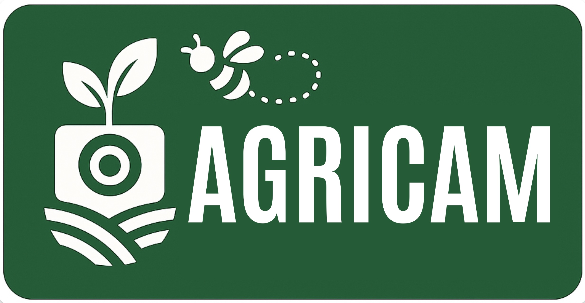

# 🌿 Welcome to the AGRICAM Documentation

**AGRICAM (*Automated Guided Robot for Insect and Crop Activity Monitoring*)** is an autonomous robotic system for monitoring agricultural environments. It is designed to gather data on insect pollinators, crop phenology, and microclimatic conditions.

This documentation provides a comprehensive technical reference for the deployment, operation, and maintenance of the AGRICAM system. The current version is optimised for use in blueberry cultivation but may be adaptable for other similar cropping systems.

 
AGRICAM V1.0 deployed in a blueberry farm

### System Capabilities

AGRICAM integrates three primary data acquisition functions to provide a multi-faceted, non-invasive monitoring solution:

| Capability | Description |
| :--- | :--- |
| 🐝 **Pollinator Activity Analysis** | Records videos and images of insect visits to blossoms. The collected data can be used to analyse pollinator activity patterns and assess pollination services. |
| 🌡️ **Microclimate Sensing** | Collects high-resolution environmental and positional data from within the crop canopy, including temperature, humidity, and GPS coordinates. This data provides environmental context for the biological observations. |

<!-- | 🫐 **Fruit Growth & Phenology Tracking** | Performs longitudinal monitoring of fruit development, tracking metrics such as growth rate, size, and color. This dataset is suitable for developing phenological models and yield forecasts. | -->

### Getting Started

This documentation provides all necessary information to get AGRICAM operational. The sections are structured to follow a logical workflow from installation to data retrieval.

| Step | Section | Description |
| :--- | :--- | :--- |
| 1 | 🔧 **Installation** | Detailed, step-by-step instructions for mounting the robot onto its pre-installed guide tracks in the field. |
| 2 | 🔌 **Setup & Connection** | Guidance on initial power-up, system checks, and connecting the robot to your local network for control. |
| 3 | 🌐 **Web App Control** | A complete overview of the web-based interface used for commanding the robot, scheduling missions, and viewing live status. |
| 4 | 📊 **Data & Monitoring** | Learn how to access, interpret, and export the data collected by the system for analysis and reporting. |
| 5 | 🔋 **Maintenance** | Essential procedures for routine upkeep, including battery replacement and sensor cleaning, to ensure long-term reliability. |
<!-- 
To begin, proceed to the [**🔧 Installation Guide**](https://www.google.com/search?q=./installation/).

### Who Is This Documentation For?

This site is the primary resource for:

* **Field Technicians** responsible for installation and maintenance.
* **Agronomists & Crop Scientists** who will utilize the data for analysis.
* **Farm Managers** overseeing operations and strategic planning.
-->

